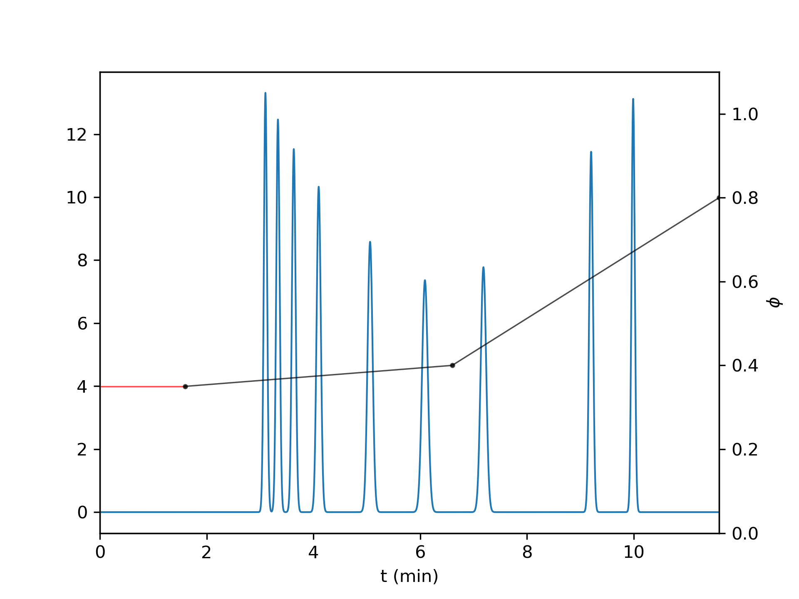

# HPLC Gradient Profile Optimization

This directory contains the Python code used to create computer simulations of chromatographic experiments and to apply optimization algorithms to them.


## Installation

Use the package and environment management system  [conda](https://docs.conda.io/projects/conda/en/latest/user-guide/install/index.html) to install the conda environment necessary to run the code in this directory from the gpo_environment.yml file.

```bash
conda env create --file gpo_environment.yml
```

## Usage

### Specifying a Sample

The filepath to the sample to be separated must be specified manually in the _read_data.py_ file. The sample must be specified in a .csv file where each row represents a single compound. The first column should contain the compound's k<sub>0</sub> value and the second column should contain the compound's S value. For examples, see the './samples/' folder.

A sample you can use for testing purposes can be found at './samples/snyder_samples/regular_sample.csv'. This is a sample taken from the book _High-Performance Gradient Elution_ by Lloyd R. Snyder and John W. Dolan. It is a sample consisting of 9 herbicides:

| Compound | k<sub>0</sub> | S |
|----------|:-------------:|------:|
| Simazine | 9.650 | 3.41 |
| Monolinuron | 11.623 | 3.65 |
| Metobromuron | 13.504 | 3.746 |
| Diuron | 16.710 | 3.891 |
| Propazine | 24.804 | 4.222 |
| Chloroxuron | 36.671 | 4.636 |
| Neburon | 50.400 | 4.882 |
| Prometryn | 113.410 | 5.546 |
| Terbutryn | 177.328 | 5.914 |


### Chromatographic Response Functions

The Chromatographic Response Function (CRF) used by default can be found in the _crf.py_ file. To turn off the penalty for gradient segments with a negative slope, comment out line 91 and 92.

To select a different CRF for the optimization algorithms to use, specify one manually in the _interface.py_ file, under the comment

**\# Calculate CRF (Change this line to choose a different CRF)**.

Different CRFs can be found in the _chromatographic_response_funcions.py_ file.

### Running an Optimization Algorithm

In root directory, run the following commands:

##### Bayesian Optimization

```bash
python bayesopt.py iterations segments
```
Replace **iterations** in the command with the number of iterations you want to algorithm to run for. Replace **segments** with the number of segments you want the gradient profile to consist of.

The runtime and the best solution that was found and its CRF score will be printed to the terminal. The virtual chromatogram produced by the best found solution will also be plotted.

##### Differential Evolution

```bash
python diffevo.py iterations segments
```
Replace **iterations** in the command with the number of iterations you want to algorithm to run for. Note that the total number of CRF evaluations is 10 x iterations, because the population size is 10. Replace **segments** with the number of segments you want the gradient profile to consist of.

The runtime and the best solution that was found and its CRF score will be printed to the terminal. The virtual chromatogram produced by the best found solution will also be plotted.

##### Genetic Algorithm

```bash
python genalgo.py iterations segments
```
Replace **iterations** in the command with the number of iterations you want to algorithm to run for. Note that the total number of CRF evaluations is 10 x iterations, because the population size is 10. Replace **segments** with the number of segments you want the gradient profile to consist of.

The runtime and the best solution that was found and its CRF score will be printed to the terminal. The virtual chromatogram produced by the best found solution will also be plotted.

##### Random Search

```bash
python random_search.py iterations segments
```
Replace **iterations** in the command with the number of iterations you want to algorithm to run for. Note that the total number of CRF evaluations is 10*iterations, because the population size is 10. Replace the word 'segments' with the number of segments you want the gradient profile to consist of.

The runtime and the best solution that was found and its CRF score will be printed to the terminal. The virtual chromatogram produced by the best found solution will also be plotted.

##### Grid Search

```bash
python grid_search.py grid_points segments
```
Replace **grid_points** in the command with the number of grid points you want in the grid for each dimension. Note that the total number of grid points is (grid_points^(2 x segments + 2)). Replace **segments** with the number of segments you want the gradient profile to consist of.

The runtime and the best solution that was found and its CRF score will be printed to the terminal. The virtual chromatogram produced by the best found solution will also be plotted.


### Creating a chromatogram from a manually specified gradient profile

To produce a virtual chromatogram from a manually specified gradient profile, first set the HPLC system parameters in _globals.py_. Then, use the following command to produce the chromatogram:

```bash
python chromatogram_given_profile.py phi_list t_list
```

Replace **phi_list** with a list of phi values; one for each turning point in the gradient profile. Replace **t_list** with a list of t values; one for each turning point in the gradient profile.

The following image shows an example of a virtual chromatogram of the sample of 9 herbicides for a given gradient profile. In this case, the 2-segment gradient profile was specified by **phi_values** = "[0.35, 0.4, 0.8]" and **t_values**" = "[0, 5, 10]".



To reproduce this chromatogram, specify the sample 'samples/snyder_samples/regular_sample.csv' in the _read_data.py_ file and run the following command:

```bash
python chromatogram_given_profile.py "[0.35, 0.4, 0.8]" "[0, 5, 10]"
```

### Generating a Sample

To generate a sample, run the following command:

```bash
python generate_sample.py bounds_k0 bounds_s sample_size filepath
```
Replace **bounds_k0** with the bounds for k<sub>0</sub>. Replace **bounds_s** with the bounds for S. Replace **sample_size** with the desired sample size and replace **filepath** with the path to the file where you want to save the sample. k<sub>0</sub> and S are sampled _uniformly_ from the given bounds.
